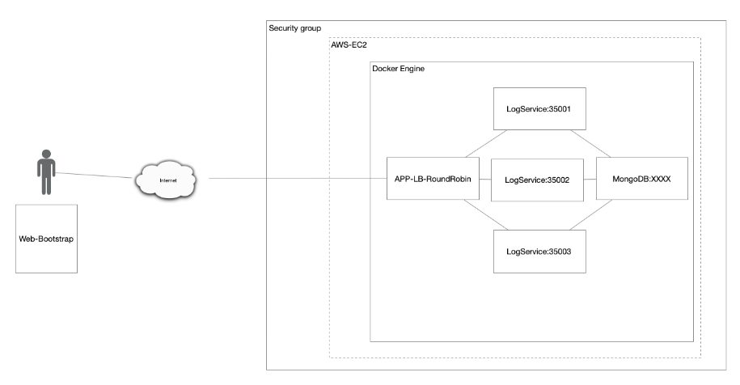
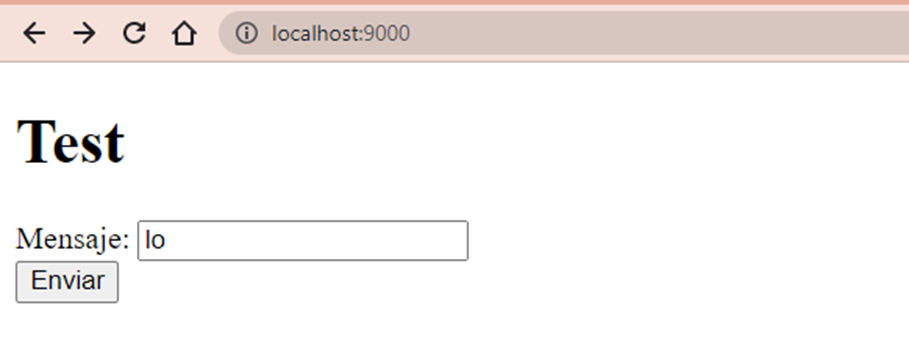
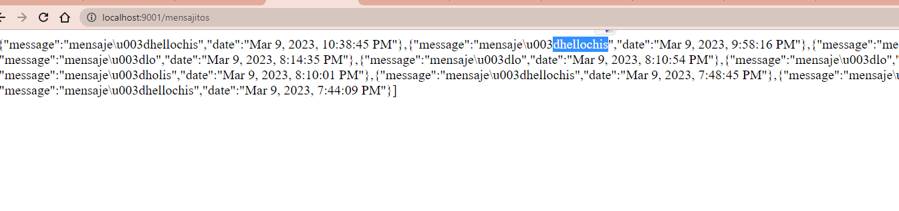
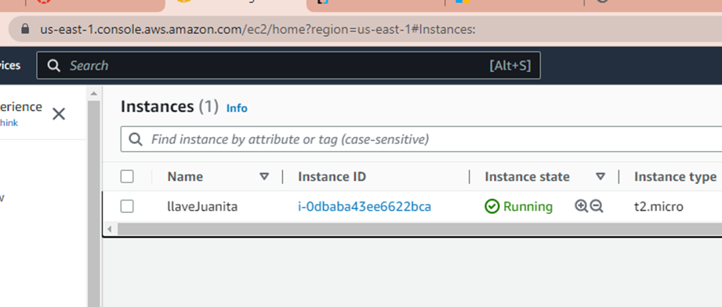
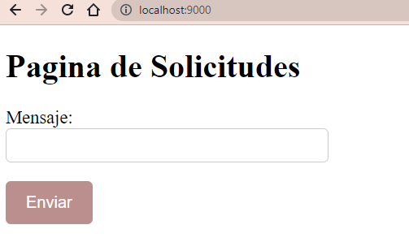

# Taller Docker AWS

## TALLER DE DE MODULARIZACIÓN CON VIRTUALIZACIÓN E INTRODUCCIÓN A DOCKER Y A AWS

## Author

**Maria Juanita Oramas Bermudez**

---


El taller consiste en crear una aplicación web pequeña usando el micro-framework de Spark java (http://sparkjava.com/). Una vez tengamos esta aplicación procederemos a construir un container para docker para la aplicación y los desplegaremos y configuraremos en nuestra máquina local. Luego, cerremos un repositorio en DockerHub y subiremos la imagen al repositorio. Finalmente, crearemos una máquina virtual de en AWS, instalaremos Docker , y desplegaremos el contenedor que acabamos de crear.

Arquitectura:



### Instrucciones de uso
Para poder usar el proyecto lo primero que debe realizar es clonar este repositorio utilizando el siguiente comando desde la terminal del SO que este utilizando:
```
git clone https://github.com/JuanitaOramas/AREP_Tallerr_DockerAWS
```
Luego debe redirigirse por medio de la terminal al directorio raíz la cual contiene el achivo pom.xml.

Una vez se encuentre en este directorio se debe compilar el programa para esto se debe ejecutar el siguiente comando:
```
mvn package
```
Para verificar la integridad del código

Para correr la clase main.java, corremos el siguiente comando en la terminal:
```
mvn compile
```

---
### Prerrequisitos

El proyecto se hizo con Maven, para visualizarlo se debe tener un framework que permita la instalacion y visualizacion de esta.
Se debe verificar las versiones:

```
Java - Desarrollo (backend)
git - Sistema de control de versiones
maven - Administrador de dependencias
Docker - Docker version 4.0.1

```

### Instalación

Para la instalación, se puede clonar este repositorio con:

```
git clone
```


## Despliegue


Para la compilación del proyecto se usa el comando:
```
mvn clean
mvn install
```

Para visualizar de la aplicación  *http://localhost:35000* desde un navegador web.

---
## Diseño
Arquitectura cliente/servidor el cual realiza peticiones a una API que implementa el algoritmo RoundRobin.

### Docker
Para la creación de la imagen el archivo (Dockerfile) y con el siguiente comando construirla
```
docker build --tag dockersparkprimer .
```
para verificarla 

```
docker images
```
Se crean los contenedores y se verifican que esten corriendo con el comando

```
docker ps
```

### AWS
Creamos una instancia de Ec2


Instalamos docker con 
```
sudo yum update -y
sudo yum install docker
```
E iniciamos el servicio con
```
sudo service docker start
```
---

## Resultados:
Pruebas:



En AWS:


Resultado Final:



---

## Construido con:

* [Intellij](http://www.dropwizard.io/1.0.2/docs/) - The web framework used
* [Maven](https://maven.apache.org/) - Dependency Management


