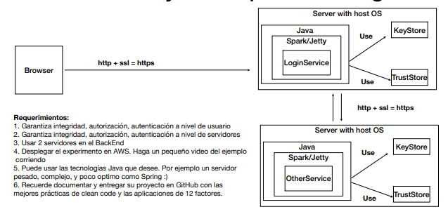
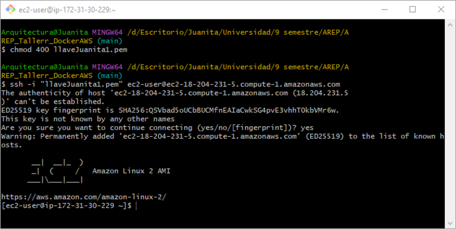
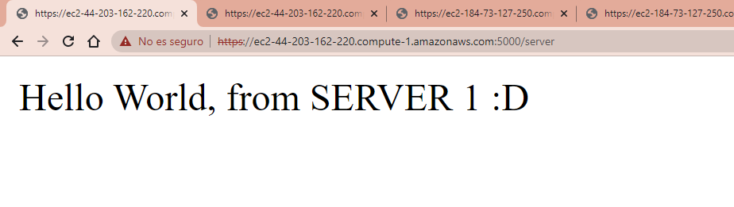
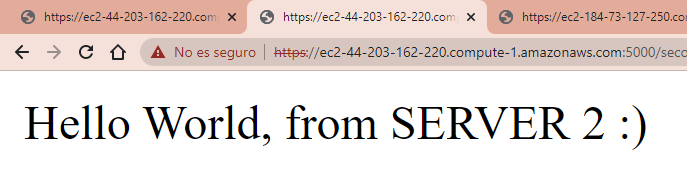
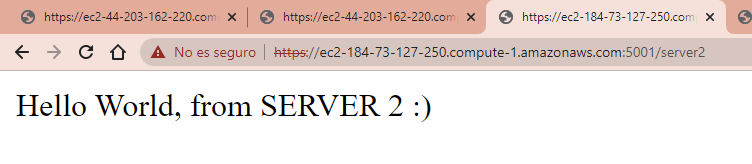
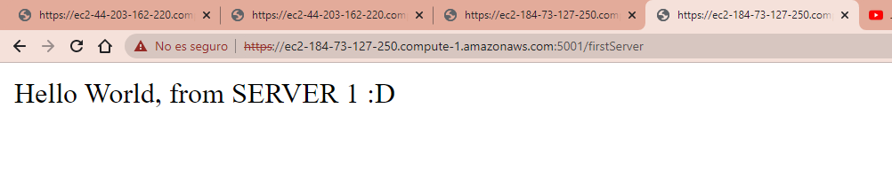

# Taller Docker AWS

## APLICACIÓN DISTRIBUIDA SEGURA EN TODOS SUS FRENTES

## Author

**Maria Juanita Oramas Bermudez**

---
Aplicación Web segura con los siguientes requerimientos:

Debe permitir un acceso seguro desde el browser a la aplicación. Es decir debe garantizar autenticación, autorización e integridad de usuarios.
Debe tener al menos dos computadores comunicacndose entre ellos y el acceso de servicios remotos debe garantizar: autenticación, autorización e integridad entre los servicios. Nadie puede invocar los servicios si no está autorizado.
Explique como escalaría su arquitectura de seguridad para incorporar nuevos servicios.

---

Arquitectura:



### Instrucciones de uso
Para poder usar el proyecto lo primero que debe realizar es clonar este repositorio utilizando el siguiente comando desde la terminal del SO que este utilizando:
```
git clone https://github.com/JuanitaOramas/AREP_Tallerr_DockerAWS
```
Luego debe redirigirse por medio de la terminal al directorio raíz la cual contiene el achivo pom.xml.

Una vez se encuentre en este directorio se debe compilar el programa para esto se debe ejecutar el siguiente comando:
```
mvn package
```
Para verificar la integridad del código

Para correr la clase main.java, corremos el siguiente comando en la terminal:
```
mvn compile
```

---
### Prerrequisitos

El proyecto se hizo con Maven, para visualizarlo se debe tener un framework que permita la instalacion y visualizacion de esta.
Se debe verificar las versiones:

```
Java - Desarrollo (backend)
git - Sistema de control de versiones
maven - Administrador de dependencias


```

### Instalación

Para la instalación, se puede clonar este repositorio con:

```
git clone
```


## Despliegue


Para la compilación del proyecto se usa el comando:
```
mvn clean  install

```

Para visualizar de la aplicación  *http://localhost:35000* desde un navegador web.

---
## Diseño
Arquitectura cliente/servidor el cual realiza peticiones a una API que implementa el algoritmo RoundRobin.


### AWS
Creamos una instancia de Ec2


### Para instalar Java 
```
sudo yum update -y
wget https://download.oracle.com/java/17/latest/jdk-17_linux-x64_bin.rpm
sudo rpm -i jdk-17_linux-x64_bin.rpm
```
Para verificar correcta instalacion
```
java -version

```

Para este caso, se utilizaron los siguientes comandos para la configuracion de los certificados

```
keytool -genkeypair -alias ecikeypair -keyalg RSA -keysize 2048 -storetype PKCS12 -keystore ecikeystore.p12 -validity 3650 -ext san=dns:ec2-44-203-162-220.compute-1.amazonaws.com
keytool -storetype PKCS12 -export -keystore ./ecikeystore.p12 -alias ecikeypair -file ecicert.cer -ext san=dns:ec2-44-203-162-220.compute-1.amazonaws.com


keytool -genkeypair -alias ecikeypair -keyalg RSA -keysize 2048 -storetype PKCS12 -keystore ecikeystore2.p12 -validity 3650 -ext san=dns:ec2-184-73-127-250.compute-1.amazonaws.com
keytool -storetype PKCS12 -export -keystore ./ecikeystore2.p12 -alias ecikeypair -file ecicert2.cer -ext san=dns:ec2-184-73-127-250.compute-1.amazonaws.com

keytool -storetype PKCS12 -import -file ./ecicert.cer -alias firstCA -keystore myTrustStore2.p12 -ext san=dns:ec2-44-203-162-220.compute-1.amazonaws.com

keytool -storetype PKCS12 -import -file ./ecicert2.cer -alias secondCA -keystore myTrustStore.p12 -ext san=dns:ec2-184-73-127-250.compute-1.amazonaws.com
```

---
## Resultados:
### Video demostracion 
https://youtu.be/tS4CASt_x8c
### Funcionamiento:


 Para la segunda: 




---

## Construido con:

* [Intellij](http://www.dropwizard.io/1.0.2/docs/) - The web framework used
* [Maven](https://maven.apache.org/) - Dependency Management


